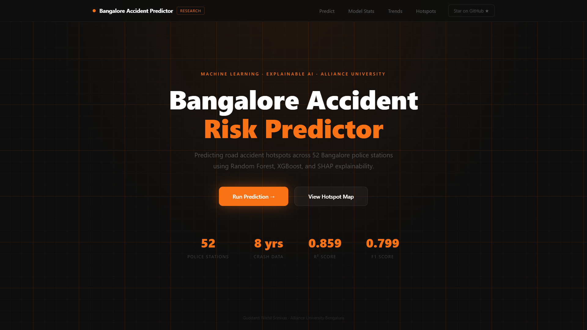
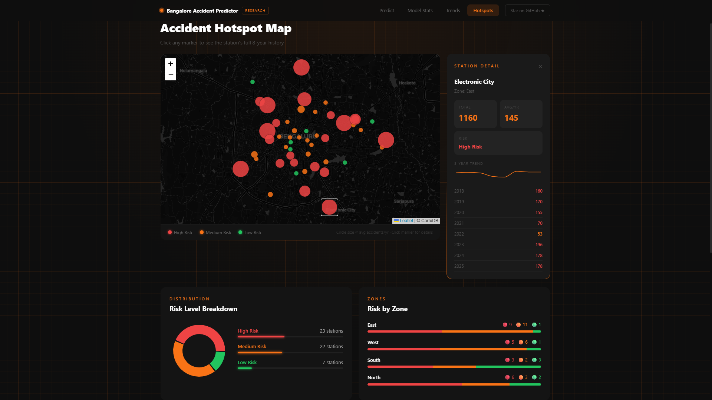
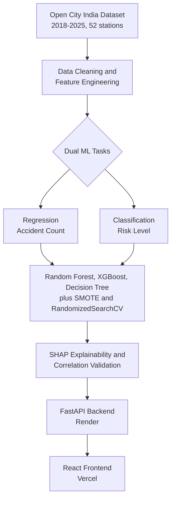

<div align="center">

# 🚦 Bangalore Accident Risk Predictor

### Predicting Road Accident Hotspots Across Bangalore Using Machine Learning & Explainable AI

[](https://bangalore-accident-prediction.vercel.app/)
[](https://bangalore-accident-prediction-api.onrender.com/)
[](https://www.python.org/)
[](https://react.dev/)
[](https://fastapi.tiangolo.com/)
[](LICENSE)

[**Live App**](https://bangalore-accident-prediction.vercel.app/) · [**API Docs**](https://bangalore-accident-prediction-api.onrender.com/docs) · [**Report Bug**](https://github.com/nikhil-0420/bangalore-accident-prediction/issues)

</div>

***

## 📌 Overview

Road traffic accidents remain a major public safety challenge in Bangalore, with station-wise crash data covering **52 police station jurisdictions** from **2018 to 2025**.

This project builds a complete end-to-end machine learning system that:
- Predicts the **expected number of accidents** at a station for a given year
- Classifies each station-year as **Low / Medium / High Risk**
- Explains predictions using **SHAP**
- Visualizes hotspots, trends, and model performance in a **live full-stack dashboard**

Unlike a static notebook project, this system is deployed as a working application with a **FastAPI backend on Render** and a **React frontend on Vercel**.

> ⚠️ **Note:** The backend runs on Render's free tier and may take 20–30 seconds to wake up on the first request.

***

## 🖥️ Dashboard Preview

### Landing View



### Hotspot Analytics View



The dashboard includes:
- **Predict** — estimate accident count, risk level, confidence, and class probabilities
- **Model Stats** — compare Random Forest, XGBoost, and Decision Tree across key metrics
- **Trends** — analyze year-wise zone trends with COVID-19 impact interpretation
- **Hotspots** — explore an interactive Leaflet map with risk-colored station markers and station-level detail panels

***

## ✨ Features

| Feature | Description |
|---|---|
| 🔍 **Risk Prediction Engine** | Select any station and year to get predicted accident count, risk level, confidence, and class probabilities |
| 📊 **Model Analytics** | Side-by-side comparison of Random Forest, XGBoost, and Decision Tree using multiple evaluation metrics |
| 📈 **Trend Analysis** | 8-year zone-wise trends, COVID-19 impact analysis, zone-vs-zone comparison, and year-over-year change tracking |
| 🗺️ **Interactive Hotspot Map** | Dark-themed Leaflet map with risk-colored markers, station history view, and distribution breakdown |
| 🧠 **Explainable AI** | SHAP-based feature importance validated against Pearson correlation |
| ⚖️ **Class Balancing** | SMOTE applied to correct the original 1.61 class imbalance ratio |
| 🎛️ **Hyperparameter Tuning** | RandomizedSearchCV with 5-fold cross-validation |

***

## 🏗️ Tech Stack

**Machine Learning**
- Python · pandas · NumPy · scikit-learn · XGBoost
- SHAP · imbalanced-learn (SMOTE)
- geopy · Folium

**Backend**
- FastAPI · Uvicorn · Joblib
- Deployed on Render

**Frontend**
- React 18 + Vite
- Tailwind CSS · Recharts · React Leaflet · Axios
- Deployed on Vercel

***

## 📐 Architecture



***

## 📊 Model Performance

> **Note on methodology:** an earlier version of this dataset silently zero-filled 82 station-years that actually had *no recorded data* (a BTP jurisdictional-boundary artifact — several stations only exist post-2023, others were discontinued around the same time), which inflated the Low Risk class and the resulting metrics. This has been corrected — missing station-years are now dropped rather than zero-filled (416 → 334 valid records) — and all metrics below are averaged across 5 stratified train/test splits (not a single lucky split) to give an honest, reproducible estimate rather than a single-run number.

### Classification (Risk Level — Low / Medium / High)

| Model | Accuracy | F1 Score |
|---|:---:|:---:|
| **Random Forest** *(final, tuned)* | **0.8388 ± 0.0198** | **0.8380 ± 0.0178** |
| XGBoost | 0.8209 ± 0.0250 | 0.8216 ± 0.0256 |
| Decision Tree | 0.8179 ± 0.0239 | 0.8197 ± 0.0219 |

*A single train/test split can make Decision Tree appear to outperform the others (up to 0.87 accuracy on some splits) — this reflects known high-variance behavior of unpruned single trees on small test sets, not genuine superior generalization. It does not hold up when averaged across multiple splits, which is why this table reports the multi-seed mean rather than any one run.*

### Regression (Annual Accident Count)

| Model | R² | RMSE | MAE |
|---|:---:|:---:|:---:|
| **Random Forest** *(final, tuned)* | **0.8106 ± 0.0561** | **27.78 ± 5.40** | 14.86 ± 1.13 |
| XGBoost | 0.7856 ± 0.0958 | 29.04 ± 7.57 | 13.69 ± 1.93 |
| Decision Tree | 0.7471 ± 0.0958 | 31.74 ± 5.69 | 17.58 ± 1.44 |
| Persistence Baseline *(predict = last year's count)* | 0.2009 ± 0.1895 | 57.47 ± 10.22 | 35.48 ± 5.03 |

### COVID-19 Regime Generalization

Trained excluding 2020–2021 entirely and tested only on those years, the tuned classifier scored **85.4% accuracy** — statistically indistinguishable from its standard held-out test performance (85.1%), yielding a generalizability gap **G ≈ -0.003**. The 2-Year Rolling Average feature successfully absorbs the pandemic-driven disruption without degrading predictive performance.

### Feature Ablation

| Feature Set | Mean Accuracy | Mean F1 | Mean R² |
|---|:---:|:---:|:---:|
| Full (all 6 features) | 0.8388 | 0.8380 | 0.8053 |
| Without Rolling_Avg | 0.8507 | 0.8489 | 0.7791 |
| Without Station/Zone | 0.8687 | 0.8679 | 0.8224 |
| **Rolling_Avg + Prev_Year only** | **0.8896** | **0.8856** | 0.8116 |

Removing `Station_Enc`/`Zone_Enc` barely affects classification and *improves* it slightly — consistent with SHAP ranking them lowest in importance. `Rolling_Avg` is the one feature whose removal reliably hurts regression, confirming it as the model's most load-bearing signal.

### Top Predictive Features (SHAP × Pearson Correlation)

| Feature | SHAP Importance | Pearson Correlation |
|---|:---:|:---:|
| 2-Year Rolling Average | Highest | +0.77 |
| Previous Year Accidents | 2nd Highest | +0.66 |
| Year-on-Year Trend | 3rd | +0.24 |

> Both explainability methods independently indicate that **a station's recent accident history** is the strongest predictor of future risk — not its zone or station identity.

***

## 🚀 Getting Started

### Prerequisites
- Python 3.10+
- Node.js 18+

### 1. Clone the repository
```bash
git clone https://github.com/nikhil-0420/bangalore-accident-prediction.git
cd bangalore-accident-prediction
```

### 2. Backend setup
```bash
python -m venv venv
venv\Scripts\activate   # Windows
# source venv/bin/activate  # macOS/Linux
pip install -r requirements.txt
cd backend
uvicorn main:app --reload
```

Backend runs at `http://localhost:8000`  
Docs at `http://localhost:8000/docs`

### 3. Frontend setup
```bash
cd frontend
npm install
npm run dev
```

Frontend runs at `http://localhost:5173`

### 4. Environment variables
Create `frontend/.env.local`:

```env
VITE_API_URL=http://localhost:8000
```

***

## 📂 Project Structure

```text
bangalore-accident-prediction/
├── assets/
│   ├── hero-preview.png
│   └── hotspots-preview.png
├── backend/
│   └── main.py
├── data/
│   └── final_perfect_dataset.csv
├── models/
│   ├── clf_model.pkl
│   ├── reg_model.pkl
│   ├── le_station.pkl
│   ├── le_zone.pkl
│   └── le_risk.pkl
├── notebooks/
│   └── accident_risk_ml_pipeline.ipynb
├── frontend/
│   └── src/
│       ├── components/
│       └── hooks/
├── requirements.txt
└── README.md
```

***

## 🔬 Methodology Highlights

1. **Data Collection** — Station-wise crash records (2018–2025) from [Open City India](https://data.opencity.in/dataset/bengaluru-road-crashes-data), geocoded using Nominatim
2. **Feature Engineering** — Year, Station, Zone, Previous Year Accidents, Year-on-Year Trend, and 2-Year Rolling Average
3. **Class Balancing** — SMOTE applied only to the training split to correct imbalance
4. **Model Comparison** — Random Forest, XGBoost, and Decision Tree evaluated on identical splits
5. **Hyperparameter Tuning** — RandomizedSearchCV with 30 iterations and 5-fold cross-validation
6. **Explainability** — SHAP TreeExplainer combined with Pearson correlation analysis
7. **Geospatial Analysis** — Risk mapping, hotspot ranking, and COVID-19 impact interpretation

***

## 🎯 Key Findings

- A station’s **recent accident history** is a much stronger predictor of future risk than its zone or station label
- A clear **COVID-19 dip** appears across zones in 2020–2021, followed by recovery in 2023–2024
- After SMOTE correction, classification performance becomes a more honest **79.8%**, instead of an inflated result on imbalanced data

***

## 🔮 Future Work

- Add weather, traffic volume, and road infrastructure features
- Move from annual to monthly or quarterly resolution
- Explore sequence models such as LSTM or Temporal CNNs
- Extend the system to accident severity prediction
- Generalize the pipeline to other Indian metro cities

***

## 👤 Author

**Guddanti Nikhil Srinivas**  
B.Tech AI & Data Science · Alliance University, Bengaluru  
📧 nikhil.guddanti@gmail.com

[GitHub](https://github.com/nikhil-0420) · [LinkedIn](https://linkedin.com/in/nikhil-srinivas-55a130337)

***

## 📄 License

This project is licensed under the MIT License — see the [LICENSE](LICENSE) file for details.

***

**⭐ If you found this project interesting, consider giving it a star.**
